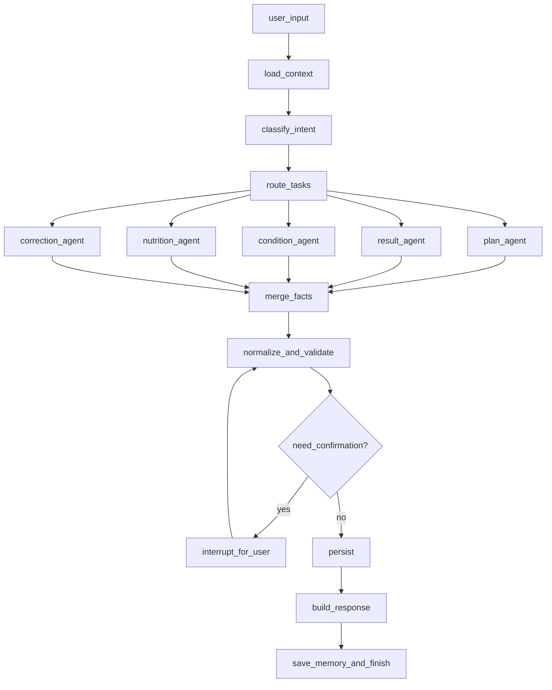

# FitMind

FitMind 是一个基于 Python + LangGraph 的健身智能体项目。它的目标不是“陪聊式健身助手”，而是把用户在自然语言中表达的训练计划、实际完成情况、身体状态和饮食信息，稳定地解析、结构化、校验，并最终写入数据库，形成可追踪、可分析、可回顾的个人健身数据系统。

这个项目的核心问题不是“如何回答用户”，而是“如何把模糊、口语化、多轮补充的健身表达，转成可靠的结构化事实”。

---

## 1. 需求分析

### 1.1 用户会怎么说

在真实场景中，用户不会按表单填写训练数据，而会直接说自然语言，例如：

- `今天练胸，卧推 60kg 5x5，再做上斜哑铃推举和夹胸。`
- `本来计划跑 8 公里，最后只跑了 5 公里，状态一般，后两公里掉速很厉害。`
- `今天睡得不好，腿有点酸，训练轻一点。`
- `晚饭吃了鸡胸肉、米饭和一杯蛋白粉。`
- `把刚才的卧推改成 55kg，不是 60kg。`
- `帮我看看这周是不是腿练少了。`

这意味着系统必须处理：

- 非结构化输入
- 多意图混合输入
- 多轮补充与纠错
- 计划与实际结果分离
- 训练、恢复、饮食之间的上下文关联
- 落库前的歧义消解与字段补全

### 1.2 FitMind 要解决的核心任务

FitMind 第一阶段聚焦四类核心信息：

1. `训练计划`
   用户今天准备练什么，计划做哪些动作、组数、次数、重量、时长、配速等。
2. `训练结果`
   用户最终实际完成了什么，是否完成计划，是否中途调整，强度如何。
3. `身体状态`
   睡眠、疲劳、酸痛、精神状态、受伤风险、恢复情况。
4. `饮食记录`
   餐次、食物、估算营养、补剂、进食时间。

系统最终要把这些信息沉淀为：

- 今日训练日志
- 今日饮食日志
- 今日状态日志
- 计划与实际偏差
- 可供后续周报、建议、复盘使用的结构化数据

### 1.3 第一阶段不做什么

为了控制复杂度，MVP 暂不追求：

- 自动生成高度个性化周期训练计划
- 医疗诊断
- 严格到克级别的营养估算
- 视觉识别动作质量
- 可穿戴设备深度联动

---

## 2. 项目定位

FitMind 本质上是一个“健身数据操作系统”上的对话式 Agent 层。

它做三件事：

1. `理解`
   理解用户当前在表达计划、结果、状态、饮食、纠错，还是查询分析。
2. `结构化`
   把自然语言拆成标准实体、标准动作、标准指标和标准事件。
3. `执行`
   在必要时确认歧义，然后安全地写入数据库，并返回总结、追问或建议。

一句话概括：

> FitMind = 对话式健身记录入口 + LangGraph 状态编排 + 结构化事实落库引擎

---

## 3. 为什么用 LangGraph

这个需求并不适合单次 prompt，也不适合一个“全能 Agent”直接自由调用数据库。原因有三个：

1. `这是一个强状态任务`
   用户会在多轮会话里补充、修改、纠错，系统需要维护“今天的上下文”和“当前待确认事实”。
2. `这是一个强约束任务`
   数据库写入必须可校验、可追踪、可回滚，不能让模型直接自由生成 SQL。
3. `这是一个混合任务`
   一部分步骤适合 LLM 推理，一部分步骤必须由确定性逻辑完成，比如 schema 校验、单位归一、字段补全策略、幂等写入。

LangGraph 非常适合这个场景，因为它支持：

- `StateGraph` 管理多轮状态
- `Command` 驱动节点流转
- `interrupt` 在歧义或高风险写入前请求用户确认
- `checkpoint` 保存会话执行状态
- 子图或子 Agent 组合确定性流程与 Agent 能力

参考资料：

- [LangChain Multi-agent](https://docs.langchain.com/oss/python/langchain/multi-agent/index)
- [LangChain Handoffs](https://docs.langchain.com/oss/python/langchain/multi-agent/handoffs)
- [LangChain Subagents](https://docs.langchain.com/oss/python/langchain/multi-agent/subagents)
- [LangGraph Human-in-the-loop](https://docs.langchain.com/oss/python/langgraph/human-in-the-loop)
- [Anthropic: Building Effective Agents](https://www.anthropic.com/engineering/building-effective-agents)

---

## 4. 主流 Agent 设计调研结论

### 4.1 主流模式

结合 LangChain/LangGraph 官方文档和 Anthropic 对生产级 Agent 的总结，当前主流模式可以粗分为五类：

1. `单 Agent + 工具`
   简单、成本低，适合能力边界明确的任务。
2. `Supervisor + Subagents`
   主 Agent 负责任务分发，子 Agent 专注单域问题，适合多能力协作。
3. `Handoffs`
   Agent 之间通过状态切换接管对话，适合“谁在和用户说话”会变化的场景。
4. `Router`
   先做意图分类，再把任务送到一个或多个专门处理器。
5. `Custom Workflow`
   用图把固定步骤和 Agent 步骤组合起来，最适合需要确定性控制、审计和落库的系统。

### 4.2 对 FitMind 的启发

FitMind 的任务不是纯问答，而是“自然语言 -> 事实提取 -> 校验 -> 持久化 -> 回执”。因此：

- 纯 `单 Agent + 工具` 太脆，容易把分类、抽取、纠错、落库耦合在一起。
- 纯 `handoff` 不够经济，因为这个场景里用户主要是对一个统一助手说话，不需要频繁“角色切换”。
- 纯 `router` 不够，因为很多输入是复合意图，例如一段话同时包含计划、状态和饮食。
- 最合适的是 `Custom Workflow + Subagents` 的混合模式。

### 4.3 最终推荐架构

FitMind 推荐采用：

`入口 Supervisor Agent + 多领域 Extraction Subagents + 确定性 Persistence Workflow`

设计原则：

- `Agent 负责理解和提取`
- `代码负责校验和写库`
- `图负责状态和流程`
- `用户负责确认歧义`

这也是最符合官方建议的落地方式：先选最简单的可控架构，在必要处引入 Agent，而不是让所有步骤都“自主决策”。

---

## 5. FitMind 核心能力定义

### 5.1 对话能力

- 识别训练计划
- 识别训练结果
- 识别身体状态
- 识别饮食摄入
- 识别纠错与修改
- 识别查询与复盘请求

### 5.2 结构化能力

- 动作标准化
- 重量、次数、组数、距离、时长、配速、RPE 标准化
- 时间标准化
- 食物实体标准化
- 身体状态标签化
- 同一条消息中的多事件拆分

### 5.3 数据能力

- 写入今日计划
- 写入今日实际训练
- 写入今日状态
- 写入今日饮食
- 更新已记录项目
- 生成训练偏差记录
- 生成可查询的日/周/月聚合数据

### 5.4 交互能力

- 信息不足时追问
- 高歧义时请求确认
- 落库后返回总结
- 支持用户纠正之前记录

---

## 6. 推荐的 Agent 设计

FitMind 不建议把每个能力都做成独立对话角色，而应该把“对用户说话”收敛为一个入口 Agent，把“内部分析”拆成多个子 Agent。

### 6.1 顶层 Agent

#### `FitMind Supervisor`

职责：

- 接收用户消息
- 识别是记录类请求、修改类请求还是查询类请求
- 判断是否需要调用一个或多个领域子 Agent
- 维护当前会话目标
- 决定是继续追问、请求确认，还是进入写库

输入：

- 用户当前消息
- 今日上下文
- 最近会话记忆
- 未完成确认事项

输出：

- 当前意图分类
- 需要调用的子 Agent 列表
- 对用户的下一步动作

### 6.2 子 Agent

#### `Workout Plan Agent`

负责从自然语言中抽取训练计划：

- 训练部位
- 动作列表
- 每个动作的计划组数/次数/重量
- 有氧项目、距离、时长、配速
- 计划训练强度

#### `Workout Result Agent`

负责抽取最终完成情况：

- 实际完成的动作与组次
- 是否完成原计划
- 中途删减、替换、加练
- 主观强度、疲劳、掉速、失败组

#### `Condition Agent`

负责抽取身体状态：

- 睡眠质量
- 疲劳程度
- 酸痛部位
- 精神状态
- 受伤/不适风险

#### `Nutrition Agent`

负责抽取饮食记录：

- 餐次
- 食物条目
- 份量描述
- 补剂
- 粗粒度营养估算

#### `Correction Agent`

负责理解用户对既有记录的修改：

- 改重量
- 改动作
- 删除记录
- 补充漏记信息

#### `Persistence Agent`

注意：这个 Agent 不直接生成 SQL。

它的职责是：

- 接收已经结构化的候选事实
- 映射到数据库 schema
- 调用确定性的 repository/service 层执行 upsert
- 返回写入结果和审计信息

#### `Insight Agent`

第二阶段使用，用于：

- 查询本周训练分布
- 对比计划与实际
- 生成简单复盘
- 输出下一步建议

---

## 7. 主链路设计

### 7.1 记录类主链路

适用于计划、结果、状态、饮食的录入。

```text
用户输入
  -> Supervisor 判断意图
  -> Router 拆分为一个或多个领域任务
  -> 并行调用 Extraction Subagents
  -> 合并结构化事实
  -> 规则校验与标准化
  -> 如果存在歧义，interrupt 请求用户确认
  -> 调用 Persistence Workflow
  -> 写入数据库
  -> 生成回执总结
```

### 7.2 修改类主链路

适用于用户说“不是 60kg，是 55kg”这类请求。

```text
用户输入
  -> Supervisor 识别为 correction
  -> 定位被修改的目标记录
  -> Correction Agent 抽取变更内容
  -> 冲突检测
  -> 必要时向用户确认修改对象
  -> 执行 update / patch
  -> 返回修改结果
```

### 7.3 查询/复盘类主链路

适用于“这周腿练够了吗”这类请求。

```text
用户输入
  -> Supervisor 识别为 query / insight
  -> 查询聚合数据
  -> Insight Agent 生成解释与建议
  -> 返回结果
```

---

## 8. 推荐的 LangGraph 图结构

下面是一个适合 MVP 的图设计。



### 8.1 节点职责

- `load_context`
  读取用户今日训练上下文、最近日志、待确认事项。
- `classify_intent`
  识别本轮是记录、修改、查询，或复合请求。
- `route_tasks`
  决定要调用哪些子 Agent。
- `merge_facts`
  把多个子 Agent 的结果合并为统一候选事实集。
- `normalize_and_validate`
  做单位归一、动作标准化、字段完整性检查、冲突检测。
- `interrupt_for_user`
  在不确定情况下停下来确认。
- `persist`
  调用服务层执行写库。
- `build_response`
  生成对用户友好的回执和总结。

---

## 9. 状态设计

建议定义一份统一的 Graph State，例如：

```python
from typing import Any, Literal
from pydantic import BaseModel


class FitMindState(BaseModel):
    user_id: str
    thread_id: str
    raw_message: str
    intent: list[str] = []
    extracted_facts: dict[str, Any] = {}
    normalized_facts: dict[str, Any] = {}
    pending_questions: list[str] = []
    pending_confirmation: dict[str, Any] | None = None
    db_operations: list[dict[str, Any]] = []
    write_result: dict[str, Any] | None = None
    response_text: str | None = None
    active_date: str | None = None
```

设计目标：

- Graph State 只保存本轮执行必要状态
- 长期记忆放数据库，不塞进 message history
- Agent 产出尽量是结构化 JSON，而不是自由文本

---

## 10. 数据库设计建议

如果目标是先把“日常记录”跑通，建议从以下最小 schema 开始。

### 10.1 核心表

#### `users`

- `id`
- `name`
- `gender`
- `age`
- `height_cm`
- `weight_kg`
- `goal`

#### `daily_logs`

- `id`
- `user_id`
- `log_date`
- `sleep_hours`
- `energy_level`
- `fatigue_level`
- `soreness_notes`
- `mood_notes`

#### `workout_sessions`

- `id`
- `user_id`
- `log_date`
- `session_type` `plan` / `actual`
- `title`
- `notes`

#### `workout_exercises`

- `id`
- `session_id`
- `exercise_name_raw`
- `exercise_name_std`
- `target_muscle`
- `order_index`

#### `exercise_sets`

- `id`
- `exercise_id`
- `set_type`
- `weight_kg`
- `reps`
- `distance_km`
- `duration_sec`
- `pace_sec_per_km`
- `rpe`
- `is_completed`

#### `nutrition_logs`

- `id`
- `user_id`
- `log_date`
- `meal_type`
- `food_name_raw`
- `food_name_std`
- `amount_text`
- `protein_g`
- `carb_g`
- `fat_g`
- `calories`

#### `audit_events`

- `id`
- `user_id`
- `thread_id`
- `event_type`
- `source_text`
- `parsed_payload`
- `status`
- `created_at`

### 10.2 为什么要区分 `plan` 和 `actual`

这是 FitMind 很重要的一点。

如果不把计划和实际分开，系统后面就无法回答：

- 今天完成度是多少
- 哪个动作被删掉了
- 哪些计划长期经常没完成
- 用户是在高估执行力，还是计划本身过重

因此建议从一开始就把 `session_type` 分成 `plan` 和 `actual`。

---

## 11. 结构化输出规范

为了让 Agent 可控，建议所有子 Agent 都输出统一 JSON，而不是直接写库。

示例：

```json
{
  "intent": ["workout_plan", "condition"],
  "workout_plan": {
    "body_part": ["chest", "triceps"],
    "exercises": [
      {
        "name_raw": "卧推",
        "name_std": "barbell_bench_press",
        "sets": [
          { "weight_kg": 60, "reps": 5, "count": 5 }
        ]
      },
      {
        "name_raw": "上斜哑铃推举",
        "name_std": "incline_dumbbell_press",
        "sets": []
      }
    ]
  },
  "condition": {
    "sleep_quality": "poor",
    "fatigue_level": "medium",
    "soreness": ["legs"]
  },
  "needs_confirmation": false
}
```

这里的关键原则是：

- `raw` 保留原词
- `std` 存标准化值
- 不确定字段显式标记缺失
- 所有写库动作在结构化输出之后执行

---

## 12. 歧义处理策略

健身记录里歧义非常常见，系统必须主动处理。

典型歧义：

- `卧推 5x5` 是 5 组 5 次，但没说重量
- `跑了半小时` 没说配速和距离
- `练了下背` 对应哪个标准动作不明确
- `吃了个汉堡` 营养只能粗估
- `今天状态不行` 需要映射成哪个等级

推荐策略：

1. 能推断但风险低的字段，用默认规则补全。
2. 影响落库质量的关键字段，主动追问。
3. 高风险修改和删除，必须确认。

可以使用 LangGraph `interrupt` 在以下场景暂停：

- 修改既有记录但目标不唯一
- 关键字段缺失导致无法可靠落库
- 多个候选标准动作置信度接近

---

## 13. MVP 建议范围

第一版建议只实现下面这条闭环：

1. 用户输入今日训练计划
2. 系统抽取并写入 `plan`
3. 用户输入今日实际完成情况
4. 系统抽取并写入 `actual`
5. 用户输入状态和饮食
6. 系统写入对应日志
7. 用户可以对当天记录做修改
8. 用户可以查询当天总结

MVP 成功标准：

- 能正确识别四大类意图
- 能把一段自然语言拆成结构化记录
- 能在歧义场景下追问
- 能稳定把结果落进数据库
- 能支持“纠错重写”

---

## 14. 建议的项目结构

```text
FitMind/
├── README.md
├── app/
│   ├── agents/
│   │   ├── supervisor.py
│   │   ├── workout_plan_agent.py
│   │   ├── workout_result_agent.py
│   │   ├── condition_agent.py
│   │   ├── nutrition_agent.py
│   │   ├── correction_agent.py
│   │   └── insight_agent.py
│   ├── graph/
│   │   ├── state.py
│   │   ├── nodes.py
│   │   ├── routes.py
│   │   └── builder.py
│   ├── schemas/
│   │   ├── intents.py
│   │   ├── workout.py
│   │   ├── nutrition.py
│   │   └── condition.py
│   ├── services/
│   │   ├── normalizer.py
│   │   ├── validator.py
│   │   ├── resolver.py
│   │   └── persistence.py
│   ├── repositories/
│   │   ├── workout_repo.py
│   │   ├── nutrition_repo.py
│   │   └── daily_log_repo.py
│   ├── prompts/
│   └── db/
│       ├── models.py
│       └── migrations/
└── tests/
```

---

## 15. 开发原则

### 15.1 Agent 不直接写数据库

Agent 只负责：

- 理解
- 抽取
- 分类
- 生成结构化候选结果

数据库操作必须经过：

- schema 校验
- 业务规则校验
- repository/service 层

### 15.2 优先结构化，不优先“聪明回答”

这个项目成功的标准不是“回复像教练”，而是：

- 数据落得准
- 修改逻辑稳定
- 日志可追溯

### 15.3 先做可审计，再做高智能

每次落库都应保留：

- 原始用户文本
- 解析结果
- 修正记录
- 最终写库 payload

这样后续才能做调试、回放和评估。

---

## 16. 后续路线图

### Phase 1

- 训练计划录入
- 训练结果录入
- 身体状态录入
- 饮食录入
- 修改记录
- 当日总结

### Phase 2

- 周报/月报
- 计划完成率分析
- 训练量趋势分析
- 饮食一致性分析
- 基于历史数据给出轻量建议

### Phase 3

- 个性化训练建议
- 周期化训练计划生成
- 智能恢复提醒
- 可穿戴设备数据接入

---

## 17. 结论

FitMind 最适合的不是“一个什么都做的大 Agent”，而是：

`一个统一对话入口 + 多个健身领域子 Agent + 一个确定性的数据库持久化工作流`

如果继续往下开发，推荐的实现顺序是：

1. 定义数据库 schema
2. 定义统一结构化输出 schema
3. 搭 LangGraph 的主流程
4. 先实现 `workout_plan` 与 `workout_result` 两个核心子 Agent
5. 接入状态和饮食
6. 最后补查询与复盘能力

这条路线最稳，也最符合 FitMind 当前需求。
