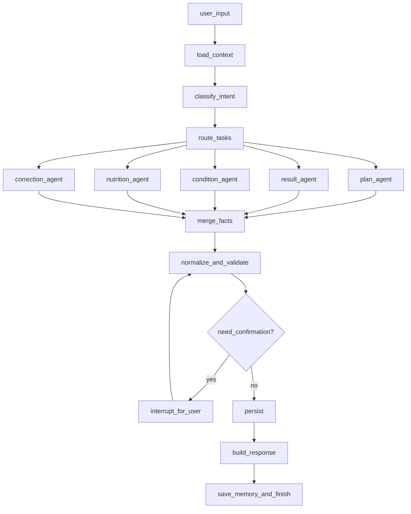

# FitMind

FitMind 是一个面向健身场景的对话式 Agent 项目。它通过 `Python + LangGraph + Web` 的组合，把用户用自然语言描述的训练计划、训练完成情况、身体状态和饮食记录，转成可以落库、查询和分析的结构化数据。

## What It Does

- 记录训练计划
- 记录实际训练结果
- 记录身体状态
- 记录饮食与补剂
- 支持自然语言补充、修改与回顾
- 为后续数据库落库和分析提供统一结构化入口

## Project Structure

```text
FitMind/
  agent/   # Python agent service, API, LangGraph workflow skeleton
  web/     # React frontend, login flow and chat workspace
  docs/    # project notes and archived design documents
```

## Architecture

FitMind 当前采用两层结构：

- `web`
  提供登录体验和对话工作台
- `agent`
  提供 Python API、对话处理入口、后续 LangGraph 工作流编排能力

推荐的核心链路是：

```text
Web Chat UI
  -> Agent API
  -> Intent / Extraction Workflow
  -> Structured Fitness Facts
  -> Database Persistence
```

## Current Status

当前仓库已经包含：

- Web 登录页和对话页原型
- Python Agent 项目骨架
- 健身数据导向的数据库设计文档

后续重点方向：

- 接通 Web 与 Agent 的真实接口
- 接入数据库和 ORM
- 实现训练计划、训练记录、状态和饮食的结构化落库

## Quick Start

### Frontend

```bash
cd web
npm install
npm run dev
```

### Agent

```bash
cd agent
python -m venv .venv
source .venv/bin/activate
pip install -e ".[dev]"
uvicorn fitmind_agent.main:app --reload --port 8000
```

## Docs

- 长版项目说明备份见 [docs/project-overview.md](docs/project-overview.md)

## Vision

FitMind 不是一个泛化聊天助手，而是一个健身数据操作系统上的自然语言入口。

它的核心价值不是“回答得像教练”，而是：

- 听懂用户今天做了什么
- 把内容整理成清晰事实
- 让训练数据真正可积累、可回看、可分析
- 补剂
- 粗粒度营养估算

#### `Correction Agent`

负责理解用户对既有记录的修改：

- 改重量
- 改动作
- 删除记录
- 补充漏记信息

#### `Persistence Agent`

注意：这个 Agent 不直接生成 SQL。

它的职责是：

- 接收已经结构化的候选事实
- 映射到数据库 schema
- 调用确定性的 repository/service 层执行 upsert
- 返回写入结果和审计信息

#### `Insight Agent`

第二阶段使用，用于：

- 查询本周训练分布
- 对比计划与实际
- 生成简单复盘
- 输出下一步建议

---

## 7. 主链路设计

### 7.1 记录类主链路

适用于计划、结果、状态、饮食的录入。

```text
用户输入
  -> Supervisor 判断意图
  -> Router 拆分为一个或多个领域任务
  -> 并行调用 Extraction Subagents
  -> 合并结构化事实
  -> 规则校验与标准化
  -> 如果存在歧义，interrupt 请求用户确认
  -> 调用 Persistence Workflow
  -> 写入数据库
  -> 生成回执总结
```

### 7.2 修改类主链路

适用于用户说“不是 60kg，是 55kg”这类请求。

```text
用户输入
  -> Supervisor 识别为 correction
  -> 定位被修改的目标记录
  -> Correction Agent 抽取变更内容
  -> 冲突检测
  -> 必要时向用户确认修改对象
  -> 执行 update / patch
  -> 返回修改结果
```

### 7.3 查询/复盘类主链路

适用于“这周腿练够了吗”这类请求。

```text
用户输入
  -> Supervisor 识别为 query / insight
  -> 查询聚合数据
  -> Insight Agent 生成解释与建议
  -> 返回结果
```

---

## 8. 推荐的 LangGraph 图结构

下面是一个适合 MVP 的图设计。



### 8.1 节点职责

- `load_context`
  读取用户今日训练上下文、最近日志、待确认事项。
- `classify_intent`
  识别本轮是记录、修改、查询，或复合请求。
- `route_tasks`
  决定要调用哪些子 Agent。
- `merge_facts`
  把多个子 Agent 的结果合并为统一候选事实集。
- `normalize_and_validate`
  做单位归一、动作标准化、字段完整性检查、冲突检测。
- `interrupt_for_user`
  在不确定情况下停下来确认。
- `persist`
  调用服务层执行写库。
- `build_response`
  生成对用户友好的回执和总结。

---

## 9. 状态设计

建议定义一份统一的 Graph State，例如：

```python
from typing import Any, Literal
from pydantic import BaseModel


class FitMindState(BaseModel):
    user_id: str
    thread_id: str
    raw_message: str
    intent: list[str] = []
    extracted_facts: dict[str, Any] = {}
    normalized_facts: dict[str, Any] = {}
    pending_questions: list[str] = []
    pending_confirmation: dict[str, Any] | None = None
    db_operations: list[dict[str, Any]] = []
    write_result: dict[str, Any] | None = None
    response_text: str | None = None
    active_date: str | None = None
```

设计目标：

- Graph State 只保存本轮执行必要状态
- 长期记忆放数据库，不塞进 message history
- Agent 产出尽量是结构化 JSON，而不是自由文本

---

## 10. 数据库设计建议

如果目标是先把“日常记录”跑通，建议从以下最小 schema 开始。

### 10.1 核心表

#### `users`

- `id`
- `name`
- `gender`
- `age`
- `height_cm`
- `weight_kg`
- `goal`

#### `daily_logs`

- `id`
- `user_id`
- `log_date`
- `sleep_hours`
- `energy_level`
- `fatigue_level`
- `soreness_notes`
- `mood_notes`

#### `workout_sessions`

- `id`
- `user_id`
- `log_date`
- `session_type` `plan` / `actual`
- `title`
- `notes`

#### `workout_exercises`

- `id`
- `session_id`
- `exercise_name_raw`
- `exercise_name_std`
- `target_muscle`
- `order_index`

#### `exercise_sets`

- `id`
- `exercise_id`
- `set_type`
- `weight_kg`
- `reps`
- `distance_km`
- `duration_sec`
- `pace_sec_per_km`
- `rpe`
- `is_completed`

#### `nutrition_logs`

- `id`
- `user_id`
- `log_date`
- `meal_type`
- `food_name_raw`
- `food_name_std`
- `amount_text`
- `protein_g`
- `carb_g`
- `fat_g`
- `calories`

#### `audit_events`

- `id`
- `user_id`
- `thread_id`
- `event_type`
- `source_text`
- `parsed_payload`
- `status`
- `created_at`

### 10.2 为什么要区分 `plan` 和 `actual`

这是 FitMind 很重要的一点。

如果不把计划和实际分开，系统后面就无法回答：

- 今天完成度是多少
- 哪个动作被删掉了
- 哪些计划长期经常没完成
- 用户是在高估执行力，还是计划本身过重

因此建议从一开始就把 `session_type` 分成 `plan` 和 `actual`。

---

## 11. 结构化输出规范

为了让 Agent 可控，建议所有子 Agent 都输出统一 JSON，而不是直接写库。

示例：

```json
{
  "intent": ["workout_plan", "condition"],
  "workout_plan": {
    "body_part": ["chest", "triceps"],
    "exercises": [
      {
        "name_raw": "卧推",
        "name_std": "barbell_bench_press",
        "sets": [
          { "weight_kg": 60, "reps": 5, "count": 5 }
        ]
      },
      {
        "name_raw": "上斜哑铃推举",
        "name_std": "incline_dumbbell_press",
        "sets": []
      }
    ]
  },
  "condition": {
    "sleep_quality": "poor",
    "fatigue_level": "medium",
    "soreness": ["legs"]
  },
  "needs_confirmation": false
}
```

这里的关键原则是：

- `raw` 保留原词
- `std` 存标准化值
- 不确定字段显式标记缺失
- 所有写库动作在结构化输出之后执行

---

## 12. 歧义处理策略

健身记录里歧义非常常见，系统必须主动处理。

典型歧义：

- `卧推 5x5` 是 5 组 5 次，但没说重量
- `跑了半小时` 没说配速和距离
- `练了下背` 对应哪个标准动作不明确
- `吃了个汉堡` 营养只能粗估
- `今天状态不行` 需要映射成哪个等级

推荐策略：

1. 能推断但风险低的字段，用默认规则补全。
2. 影响落库质量的关键字段，主动追问。
3. 高风险修改和删除，必须确认。

可以使用 LangGraph `interrupt` 在以下场景暂停：

- 修改既有记录但目标不唯一
- 关键字段缺失导致无法可靠落库
- 多个候选标准动作置信度接近

---

## 13. MVP 建议范围

第一版建议只实现下面这条闭环：

1. 用户输入今日训练计划
2. 系统抽取并写入 `plan`
3. 用户输入今日实际完成情况
4. 系统抽取并写入 `actual`
5. 用户输入状态和饮食
6. 系统写入对应日志
7. 用户可以对当天记录做修改
8. 用户可以查询当天总结

MVP 成功标准：

- 能正确识别四大类意图
- 能把一段自然语言拆成结构化记录
- 能在歧义场景下追问
- 能稳定把结果落进数据库
- 能支持“纠错重写”

---

## 14. 建议的项目结构

```text
FitMind/
├── README.md
├── app/
│   ├── agents/
│   │   ├── supervisor.py
│   │   ├── workout_plan_agent.py
│   │   ├── workout_result_agent.py
│   │   ├── condition_agent.py
│   │   ├── nutrition_agent.py
│   │   ├── correction_agent.py
│   │   └── insight_agent.py
│   ├── graph/
│   │   ├── state.py
│   │   ├── nodes.py
│   │   ├── routes.py
│   │   └── builder.py
│   ├── schemas/
│   │   ├── intents.py
│   │   ├── workout.py
│   │   ├── nutrition.py
│   │   └── condition.py
│   ├── services/
│   │   ├── normalizer.py
│   │   ├── validator.py
│   │   ├── resolver.py
│   │   └── persistence.py
│   ├── repositories/
│   │   ├── workout_repo.py
│   │   ├── nutrition_repo.py
│   │   └── daily_log_repo.py
│   ├── prompts/
│   └── db/
│       ├── models.py
│       └── migrations/
└── tests/
```

---

## 15. 开发原则

### 15.1 Agent 不直接写数据库

Agent 只负责：

- 理解
- 抽取
- 分类
- 生成结构化候选结果

数据库操作必须经过：

- schema 校验
- 业务规则校验
- repository/service 层

### 15.2 优先结构化，不优先“聪明回答”

这个项目成功的标准不是“回复像教练”，而是：

- 数据落得准
- 修改逻辑稳定
- 日志可追溯

### 15.3 先做可审计，再做高智能

每次落库都应保留：

- 原始用户文本
- 解析结果
- 修正记录
- 最终写库 payload

这样后续才能做调试、回放和评估。

---

## 16. 后续路线图

### Phase 1

- 训练计划录入
- 训练结果录入
- 身体状态录入
- 饮食录入
- 修改记录
- 当日总结

### Phase 2

- 周报/月报
- 计划完成率分析
- 训练量趋势分析
- 饮食一致性分析
- 基于历史数据给出轻量建议

### Phase 3

- 个性化训练建议
- 周期化训练计划生成
- 智能恢复提醒
- 可穿戴设备数据接入

---

## 17. 结论

FitMind 最适合的不是“一个什么都做的大 Agent”，而是：

`一个统一对话入口 + 多个健身领域子 Agent + 一个确定性的数据库持久化工作流`

如果继续往下开发，推荐的实现顺序是：

1. 定义数据库 schema
2. 定义统一结构化输出 schema
3. 搭 LangGraph 的主流程
4. 先实现 `workout_plan` 与 `workout_result` 两个核心子 Agent
5. 接入状态和饮食
6. 最后补查询与复盘能力

这条路线最稳，也最符合 FitMind 当前需求。
